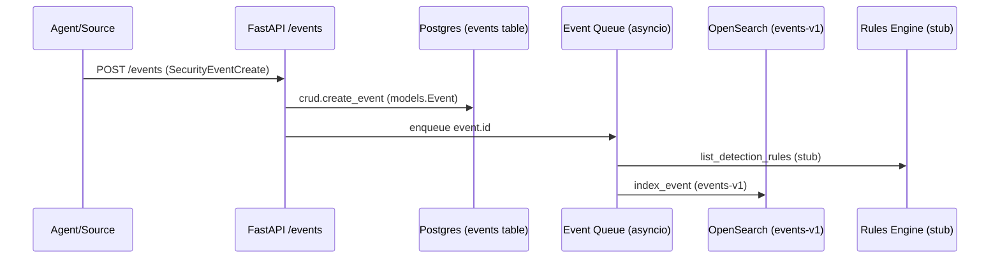

# Ingest Flow (collector → parser → storage → rules)

Fuente: `backend/app/routers/events_router.py`, `backend/app/main.py`, `backend/app/search.py`, `docker-compose.yml`.

Notas:
- La normalización actual ocurre en `process_event_queue()` construyendo el `doc` indexado (no hay parser dedicado ni transformaciones declarativas).
- El motor de reglas consulta la lista de reglas (`crud.list_detection_rules`) pero no aplica lógica de detección en el código actual.
- OpenSearch índices definidos en `search.ensure_indices()` con mappings básicos.
