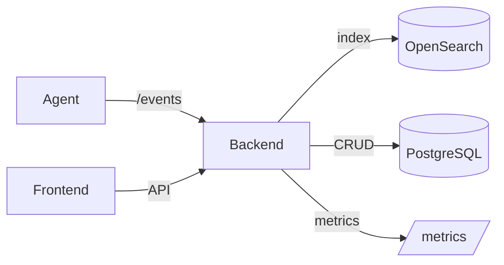

# Architecture Overview (EventSec)

## High-level diagram

## OpenSearch indices (runtime)
- events-v1: eventos normalizados
- alerts-v1: alertas indexadas
- raw-events-YYYY.MM.DD: eventos RAW pre-normalización
- dlq-events-YYYY.MM.DD: fallos de parse/ingest

## Endpoints clave por dominio
### Ingest
- `POST /events` (backend/app/routers/events_router.py)
- `POST /siem/events` (backend/app/routers/siem_router.py, demo)
- `POST /edr/events` (backend/app/routers/edr_router.py, demo)

### KQL / Search
- `POST /search/kql` (backend/app/routers/kql_router.py)

### Rules
- `GET /rules/detections`
- `POST /rules/detections`

### Alerts / Cases
- `GET /alerts`
- `POST /alerts`
- `PATCH /alerts/{alert_id}`

### EDR Actions
- `POST /endpoints/{endpoint_id}/actions`
- `GET /agent/actions`
- `POST /agent/actions/{action_id}/complete`

### Auth / RBAC
- `POST /auth/login`
- `GET /me`
