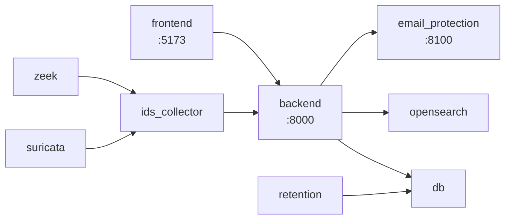

# Setup con Docker Compose

## Servicios (docker-compose.yml)

| Servicio | Propósito | Puertos | Volúmenes | Depends on |
| --- | --- | --- | --- | --- |
| `opensearch` | Búsqueda/índices para eventos y alertas | `9200:9200` | `eventsec_os_data` | - |
| `db` | Postgres 15 para datos transaccionales | `5432:5432` | `eventsec_db_data` | - |
| `backend` | API FastAPI (migraciones + seed en entrypoint) | `8000:8000` | `./infra/certs:/certs:ro` | `db`, `opensearch` |
| `frontend` | UI React/Vite | `5173:5173` | - | `backend` |
| `retention` | Tarea diaria de mantenimiento (`app.maintenance`) | - | - | `backend` |
| `email_protection` | Conectores Gmail/M365 | `8100:8100` | - | `backend` |
| `scanner` | Utilidad de triage (perfil `scanner`) | - | `./scanner_out:/app/triage_out` | - |
| `suricata` | IDS (perfil `ids`) | - | `suricata_logs` | - |
| `zeek` | IDS (perfil `ids`) | - | `zeek_logs` | - |
| `ids_collector` | Ingesta de logs IDS hacia backend | - | `suricata_logs`, `zeek_logs`, `collector_state` | `backend` |

## Arranque básico

```bash
docker compose up -d --build
```

> **Linux:** OpenSearch requiere `vm.max_map_count >= 262144`.
> ```bash
> sudo sysctl -w vm.max_map_count=262144
> ```

## Perfiles opcionales

```bash
# Scanner
docker compose --profile scanner up -d

# IDS (Suricata + Zeek + collector)
docker compose --profile ids up -d
```

## Runbooks operativos

### Levantar / Parar / Reconstruir
```bash
docker compose up -d --build
```

```bash
docker compose down
```

```bash
docker compose build --no-cache backend frontend
```

### Ver logs por servicio
```bash
docker compose logs -f --tail=200 backend
```

```bash
docker compose logs -f --tail=200 frontend
```

### Ejecutar comandos dentro de un contenedor
```bash
docker compose exec backend bash
```

### Resetear DB (DEV)
**Borra todos los datos de Postgres y OpenSearch**:

```bash
docker compose down -v
```

### Reset + smoke test (DEV)
Ejecuta un reset completo y valida DB + login:

```bash
bash scripts/dev_reset_and_smoke.sh
```

### Ejecutar migraciones Alembic
El backend ejecuta migraciones en el arranque, pero puedes forzar:

```bash
docker compose exec backend alembic upgrade head
```

### Generar SQL offline de Alembic (sin ejecutar)
Para generar el SQL y aplicarlo manualmente en Postgres:

```bash
docker compose exec -T backend sh -lc \
  'alembic -c /app/alembic.ini upgrade heads --sql' > alembic_upgrade.sql

docker compose exec -T db psql -U eventsec -d eventsec -v ON_ERROR_STOP=1 \
  < alembic_upgrade.sql
```

Si tu salida todavía incluye logs (INFO/DEBUG) al inicio, filtra con:

```bash
docker compose exec -T backend sh -lc \
  'alembic -c /app/alembic.ini upgrade heads --sql' \
  | sed -E '/^(INFO|DEBUG|WARNING|ERROR)\\b/d' > alembic_upgrade.sql
```

## Diagrama (compose)


