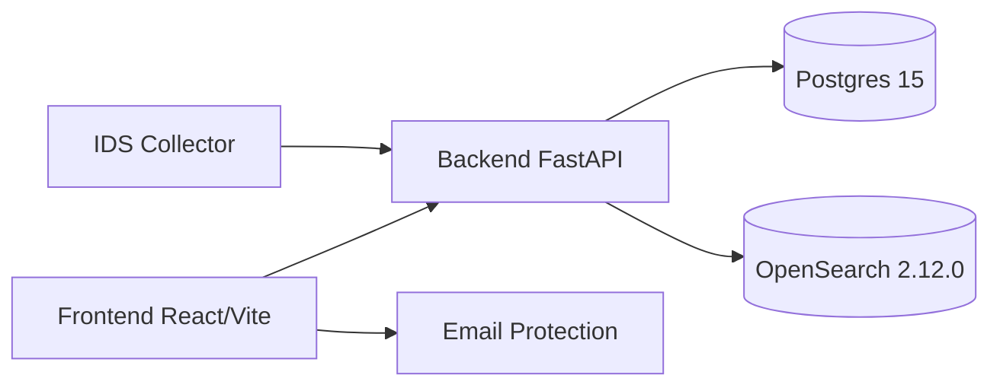
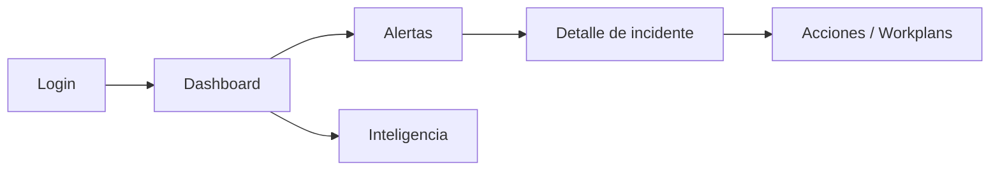

# Arquitectura

## Vista de alto nivel



## Flujo de datos (ingesta → detección → incidentes)

```mermaid
flowchart LR
  ingest[Ingesta (agents/IDS/email)] --> normalize[Normalización + almacenamiento]
  normalize --> detect[Reglas / correlación]
  detect --> alerts[Alertas]
  alerts --> incidents[Incidentes]
  incidents --> response[Respuesta / Workplans]
```

## Flujo de usuario (login → operaciones)



## Componentes principales

### Backend (FastAPI)
- `backend/app/main.py`: inicialización de FastAPI + routers + health/metrics.
- `backend/app/routers/`: APIs por dominio (`/events`, `/alerts`, `/incidents`, `/network`, `/search`, etc.).
- `backend/app/models.py`: modelos SQLAlchemy (usuarios, alertas, incidentes, workplans...).
- `backend/app/crud.py`: acceso a datos.
- `backend/app/auth.py`: JWT y autorización por roles.
- `backend/app/search.py`: integración OpenSearch.
- `backend/app/threatmap/`: agregación y WebSocket `/ws/threatmap`.
- `backend/app/maintenance.py`: tareas de retención (servicio `retention`).

### Frontend (React + Vite)
- `frontend/src/App.tsx`: rutas principales y protección por autenticación.
- `frontend/src/pages/`: páginas de dashboard, alertas, incidentes, network security, email security e inteligencia.
- `frontend/src/components/`: UI compartida (layout, dialogs, estados de carga, etc.).

## Decisiones de diseño (factual)
- **Backend** usa FastAPI + SQLAlchemy + Alembic para API y migraciones.
- **OpenSearch** es el motor de búsqueda/eventos; **Postgres** almacena entidades core.
- **Frontend** usa Vite con `5173` para dev server.
