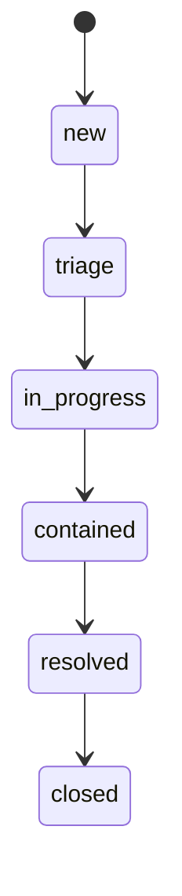
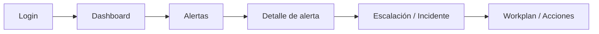

# Workflows (alertas, incidentes, notificaciones)

## Ciclo de vida de alertas
Los estados de alerta están definidos en `backend/app/schemas.py`:
- `open`
- `in_progress`
- `closed`

## Ciclo de vida de incidentes
Estados definidos en `backend/app/schemas.py`:
- `new` → `triage` → `in_progress` → `contained` → `resolved` → `closed`

## Relación alerta → incidente
- El backend evalúa reglas de detección y puede **crear incidentes automáticamente**.
- Se crea incidente cuando:
  - la regla tiene `create_incident=true`, o
  - `INCIDENT_AUTO_CREATE_ENABLED=true` y la severidad cumple `INCIDENT_AUTO_CREATE_MIN_SEVERITY`.

Referencia: `backend/app/main.py` (procesamiento de eventos y reglas).

## Flujo operativo típico (UI)

## Reglas y biblioteca
- UI: ruta `/detections/rules` (`RuleLibraryPage`).
- API: `GET/POST /rules/detections` (`backend/app/routers/rules_router.py`).
- Importación opcional de rule packs: `backend/app/scripts/import_rules.py`.

## Notificaciones
- Se envían notificaciones (por email) al crear incidentes automáticos si se configuran
  `MANAGER_EMAILS`, `LEVEL1_DL`, `LEVEL2_DL` en el backend (`backend/app/notifications.py`).

## Email Protection / Email Security
- Servicio en `email_protection/` expone APIs OAuth y threat-intel (ver `email_protection/README.md`).
- UI en rutas `/email-protection` y `/email-security/*`.

> GAP: algunas acciones de Email Threat Intel están marcadas como mock-first en el frontend
> (`frontend/src/pages/EmailSecurity/EmailThreatIntelPage.tsx`).
