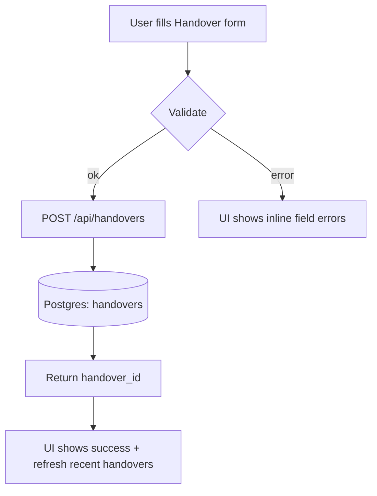

# Handover persistence flow

```mermaid
flowchart TD
  A[User fills Handover form] --> B{Validate}
  B -- ok --> C[POST /api/handovers]
  C --> D[(Postgres: handovers)]
  D --> E[Return handover_id]
  E --> F[UI shows success + refresh recent handovers]
  B -- error --> G[UI shows inline field errors]
```
